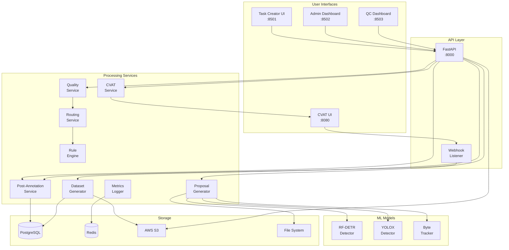
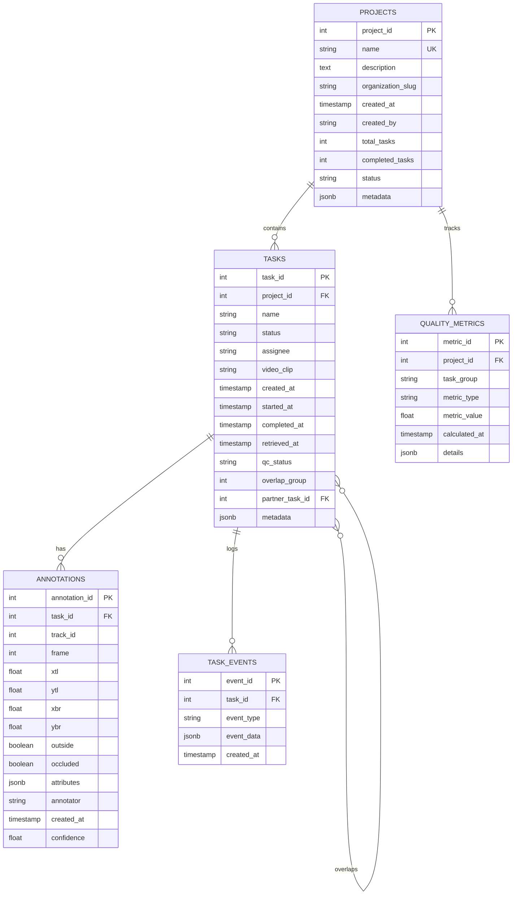

# AVA_Kinetics_QC: Architecture Diagrams

## Table of Contents

1. [System Architecture Overview](#1-system-architecture-overview)
2. [Component Architecture](#2-component-architecture)
3. [Data Flow Architecture](#3-data-flow-architecture)
4. [Deployment Architecture](#4-deployment-architecture)
5. [Database Schema](#5-database-schema)
6. [Service Interaction Diagram](#6-service-interaction-diagram)
7. [Quality Control Pipeline](#7-quality-control-pipeline)
8. [Network Architecture](#8-network-architecture)
9. [Module Dependency Graph](#9-module-dependency-graph)

---

## 1. System Architecture Overview

### High-Level System Architecture

```
┌────────────────────────────────────────────────────────────────────────────┐
│                        AVA_KINETICS_QC SYSTEM ARCHITECTURE                  │
├────────────────────────────────────────────────────────────────────────────┤
│                                                                             │
│  ┌─────────────────────────────────────────────────────────────────────┐  │
│  │                         PRESENTATION LAYER                           │  │
│  │  ┌────────────┐  ┌────────────┐  ┌────────────┐  ┌────────────┐  │  │
│  │  │  Task      │  │   Admin    │  │    QC      │  │   CVAT     │  │  │
│  │  │  Creator   │  │ Dashboard  │  │ Dashboard  │  │    UI      │  │  │
│  │  │(Streamlit) │  │(Streamlit) │  │(Streamlit) │  │  (React)   │  │  │
│  │  │  :8501     │  │  :8502     │  │  :8503     │  │  :8080     │  │  │
│  │  └────┬───────┘  └────┬───────┘  └────┬───────┘  └────┬───────┘  │  │
│  └───────┼───────────────┼───────────────┼───────────────┼──────────┘  │
│          │               │               │               │              │
│  ┌───────▼───────────────▼───────────────▼───────────────▼──────────┐  │
│  │                         API GATEWAY LAYER                          │  │
│  │  ┌──────────────────────────────────────────────────────────┐    │  │
│  │  │                   FastAPI Application                     │    │  │
│  │  │                      (Port: 8000)                        │    │  │
│  │  │  ┌──────────┐ ┌──────────┐ ┌──────────┐ ┌──────────┐  │    │  │
│  │  │  │   Pre-   │ │   Task   │ │ Quality  │ │ Metrics  │  │    │  │
│  │  │  │Annotation│ │ Creator  │ │ Control  │ │   API    │  │    │  │
│  │  │  │  Router  │ │  Router  │ │  Router  │ │  Router  │  │    │  │
│  │  │  └──────────┘ └──────────┘ └──────────┘ └──────────┘  │    │  │
│  │  └──────────────────────────────────────────────────────────┘    │  │
│  └────────────────────────────────────────────────────────────────────┘  │
│                                    │                                     │
│  ┌─────────────────────────────────▼─────────────────────────────────┐  │
│  │                      BUSINESS LOGIC LAYER                          │  │
│  │                                                                    │  │
│  │  ┌──────────────┐  ┌──────────────┐  ┌──────────────┐          │  │
│  │  │   Proposal   │  │    Post-     │  │   Quality    │          │  │
│  │  │  Generation  │  │  Annotation  │  │   Service    │          │  │
│  │  │   Pipeline   │  │   Service    │  │              │          │  │
│  │  └──────┬───────┘  └──────┬───────┘  └──────┬───────┘          │  │
│  │         │                  │                  │                   │  │
│  │  ┌──────▼───────┐  ┌──────▼───────┐  ┌──────▼───────┐          │  │
│  │  │   CVAT       │  │   Routing    │  │    Rule      │          │  │
│  │  │ Integration  │  │   Service    │  │   Engine     │          │  │
│  │  └──────┬───────┘  └──────┬───────┘  └──────┬───────┘          │  │
│  │         │                  │                  │                   │  │
│  │  ┌──────▼───────┐  ┌──────▼───────┐  ┌──────▼───────┐          │  │
│  │  │  Assignment  │  │   Dataset    │  │   Metrics    │          │  │
│  │  │  Generator   │  │  Generator   │  │   Logger     │          │  │
│  │  └──────────────┘  └──────────────┘  └──────────────┘          │  │
│  └────────────────────────────────────────────────────────────────────┘  │
│                                    │                                     │
│  ┌─────────────────────────────────▼─────────────────────────────────┐  │
│  │                       DATA ACCESS LAYER                            │  │
│  │                                                                    │  │
│  │  ┌──────────────┐  ┌──────────────┐  ┌──────────────┐          │  │
│  │  │  PostgreSQL  │  │    Redis     │  │   AWS S3     │          │  │
│  │  │  Connection  │  │    Cache     │  │   Client     │          │  │
│  │  │     Pool     │  │              │  │              │          │  │
│  │  └──────┬───────┘  └──────┬───────┘  └──────┬───────┘          │  │
│  └─────────┼──────────────────┼──────────────────┼──────────────────┘  │
│            │                  │                  │                      │
│  ┌─────────▼──────────────────▼──────────────────▼──────────────────┐  │
│  │                      STORAGE LAYER                                │  │
│  │                                                                   │  │
│  │  ┌────────────┐  ┌────────────┐  ┌────────────┐  ┌──────────┐  │  │
│  │  │PostgreSQL  │  │   Redis    │  │  AWS S3    │  │  Local   │  │  │
│  │  │ Database   │  │   Server   │  │   Bucket   │  │  Files   │  │  │
│  │  │            │  │            │  │            │  │          │  │  │
│  │  │- Projects  │  │- Sessions  │  │- Uploads   │  │- Models  │  │  │
│  │  │- Tasks     │  │- Queues    │  │- Datasets  │  │- Frames  │  │  │
│  │  │- Annots    │  │- Metrics   │  │- Archives  │  │- XMLs    │  │  │
│  │  └────────────┘  └────────────┘  └────────────┘  └──────────┘  │  │
│  └────────────────────────────────────────────────────────────────────┘  │
│                                                                           │
└────────────────────────────────────────────────────────────────────────────┘
```

### Microservices Architecture

```
┌──────────────────────────────────────────────────────────────────────┐
│                     MICROSERVICES ARCHITECTURE                        │
├──────────────────────────────────────────────────────────────────────┤
│                                                                       │
│  ┌─────────────────┐         ┌─────────────────┐                   │
│  │ Proposal Gen    │         │ Task Creation   │                   │
│  │   Service       │────────▶│    Service      │                   │
│  │                 │         │                 │                   │
│  │ - Video Process │         │ - CVAT Project  │                   │
│  │ - Keyframe Sel. │         │ - Task Upload   │                   │
│  │ - Detection     │         │ - Assignment    │                   │
│  └─────────────────┘         └────────┬────────┘                   │
│                                       │                              │
│                                       ▼                              │
│  ┌─────────────────┐         ┌─────────────────┐                   │
│  │   Annotation    │◀────────│      CVAT       │                   │
│  │    Service      │         │     Server      │                   │
│  │                 │         │                 │                   │
│  │ - Export        │         │ - UI Server     │                   │
│  │ - Parse XML     │         │ - API Server    │                   │
│  │ - Store DB      │         │ - Worker Queue  │                   │
│  └────────┬────────┘         └─────────────────┘                   │
│           │                                                          │
│           ▼                                                          │
│  ┌─────────────────┐         ┌─────────────────┐                   │
│  │ Quality Control │────────▶│   Dataset Gen   │                   │
│  │    Service      │         │    Service      │                   │
│  │                 │         │                 │                   │
│  │ - IoU Calc      │         │ - Consensus     │                   │
│  │ - Kappa Calc    │         │ - AVA Format    │                   │
│  │ - Rule Valid    │         │ - S3 Upload     │                   │
│  └─────────────────┘         └─────────────────┘                   │
│                                                                       │
│  ┌─────────────────┐         ┌─────────────────┐                   │
│  │    Metrics      │         │    Routing      │                   │
│  │    Service      │◀────────│    Service      │                   │
│  │                 │         │                 │                   │
│  │ - Event Log     │         │ - Partner Find  │                   │
│  │ - Aggregation   │         │ - Adjudication  │                   │
│  │ - Statistics    │         │ - Audit Sample  │                   │
│  └─────────────────┘         └─────────────────┘                   │
│                                                                       │
└──────────────────────────────────────────────────────────────────────┘
```

---

## 2. Component Architecture

### Component Interaction Diagram



### Service Dependencies

```
┌─────────────────────────────────────────────────────────────────┐
│                    SERVICE DEPENDENCY MATRIX                     │
├─────────────────────────────────────────────────────────────────┤
│                                                                  │
│  orchestrator.py ────────┐                                      │
│        │                 ▼                                      │
│        ├──────► keyframe_selector.py ──────► RF-DETR Model     │
│        │                 │                                      │
│        ├──────► person_tracker.py ──────► YOLOX + ByteTracker  │
│        │                 │                                      │
│        ├──────► create_proposals.py                            │
│        │                 │                                      │
│        └──────► proposals_to_cvat.py                          │
│                          │                                      │
│  app.py (Task Creator)   │                                      │
│        │                 ▼                                      │
│        ├──────► cvat_integration.py ──────► CVAT Server       │
│        │                 │                                      │
│        └──────► assignment_generator.py                        │
│                          │                                      │
│  post_annotation_service.py                                    │
│        │                 │                                      │
│        ├──────► cvat_integration.py                           │
│        │                 │                                      │
│        ├──────► rule_engine.py ◄──────── rules.yaml          │
│        │                 │                                      │
│        └──────► PostgreSQL Database                           │
│                          │                                      │
│  quality_service.py      │                                      │
│        │                 ▼                                      │
│        ├──────► routing_service.py                            │
│        │                 │                                      │
│        └──────► PostgreSQL Database                           │
│                          │                                      │
│  dataset_generator.py    │                                      │
│        │                 ▼                                      │
│        ├──────► PostgreSQL Database                           │
│        │                                                        │
│        └──────► AWS S3 Client                                 │
│                                                                  │
└─────────────────────────────────────────────────────────────────┘
```

---

## 3. Data Flow Architecture

### End-to-End Data Flow

```
┌──────────────────────────────────────────────────────────────────────┐
│                        END-TO-END DATA FLOW                          │
├──────────────────────────────────────────────────────────────────────┤
│                                                                       │
│  [Raw Videos ZIP]                                                    │
│        │                                                              │
│        ▼                                                              │
│  ┌──────────────┐                                                   │
│  │   STAGE 1:   │  ┌─────────────────────────┐                     │
│  │ Preprocessing│──│ • Extract videos         │                     │
│  └──────┬───────┘  │ • Resize to standard    │                     │
│         │          │ • Generate metadata      │                     │
│         │          └─────────────────────────┘                     │
│         ▼                                                            │
│  ┌──────────────┐                                                   │
│  │   STAGE 2:   │  ┌─────────────────────────┐                     │
│  │   Keyframe   │──│ • RF-DETR scoring        │                     │
│  │  Selection   │  │ • Best frame selection   │                     │
│  └──────┬───────┘  │ • Quality assessment     │                     │
│         │          └─────────────────────────┘                     │
│         ▼                                                            │
│  ┌──────────────┐                                                   │
│  │   STAGE 3:   │  ┌─────────────────────────┐                     │
│  │   Detection  │──│ • YOLOX person detection │                     │
│  │  & Tracking  │  │ • ByteTracker tracking   │                     │
│  └──────┬───────┘  │ • Track ID assignment    │                     │
│         │          └─────────────────────────┘                     │
│         ▼                                                            │
│  ┌──────────────┐                                                   │
│  │   STAGE 4:   │  ┌─────────────────────────┐                     │
│  │   Proposal   │──│ • Dense proposals pickle │                     │
│  │  Generation  │  │ • Manifest creation       │                     │
│  └──────┬───────┘  │ • Package preparation    │                     │
│         │          └─────────────────────────┘                     │
│         ▼                                                            │
│  ┌──────────────┐                                                   │
│  │   STAGE 5:   │  ┌─────────────────────────┐                     │
│  │     Task     │──│ • CVAT project creation  │                     │
│  │   Creation   │  │ • ZIP/XML upload         │                     │
│  └──────┬───────┘  │ • Annotator assignment   │                     │
│         │          └─────────────────────────┘                     │
│         ▼                                                            │
│  ┌──────────────┐                                                   │
│  │   STAGE 6:   │  ┌─────────────────────────┐                     │
│  │  Annotation  │──│ • Manual refinement      │                     │
│  │    Phase     │  │ • Attribute labeling     │                     │
│  └──────┬───────┘  │ • Multi-annotator work   │                     │
│         │          └─────────────────────────┘                     │
│         ▼                                                            │
│  ┌──────────────┐                                                   │
│  │   STAGE 7:   │  ┌─────────────────────────┐                     │
│  │   Retrieval  │──│ • Export from CVAT       │                     │
│  │  & Storage   │  │ • Parse XML              │                     │
│  └──────┬───────┘  │ • Store in PostgreSQL    │                     │
│         │          └─────────────────────────┘                     │
│         ▼                                                            │
│  ┌──────────────┐                                                   │
│  │   STAGE 8:   │  ┌─────────────────────────┐                     │
│  │   Quality    │──│ • IoU calculation        │                     │
│  │   Control    │  │ • Kappa computation      │                     │
│  └──────┬───────┘  │ • Rule validation        │                     │
│         │          └─────────────────────────┘                     │
│         ▼                                                            │
│  ┌──────────────┐                                                   │
│  │   STAGE 9:   │  ┌─────────────────────────┐                     │
│  │   Dataset    │──│ • Consensus application  │                     │
│  │  Generation  │  │ • AVA CSV format         │                     │
│  └──────┬───────┘  │ • S3 upload              │                     │
│         │          └─────────────────────────┘                     │
│         ▼                                                            │
│  [Final AVA Dataset]                                                 │
│                                                                       │
└──────────────────────────────────────────────────────────────────────┘
```

### Data Transformation Pipeline

```
┌────────────────────────────────────────────────────────────────┐
│                   DATA TRANSFORMATION PIPELINE                  │
├────────────────────────────────────────────────────────────────┤
│                                                                 │
│  Input Formats           Processing           Output Formats    │
│                                                                 │
│  ┌──────────┐           ┌──────────┐        ┌──────────┐     │
│  │   MP4    │──────────▶│  Frame   │───────▶│  JPEG    │     │
│  │  Video   │           │ Extract  │        │  Frames  │     │
│  └──────────┘           └──────────┘        └──────────┘     │
│                                                   │            │
│                                                   ▼            │
│  ┌──────────┐           ┌──────────┐        ┌──────────┐     │
│  │  JPEG    │──────────▶│ Detection│───────▶│  JSON    │     │
│  │  Frames  │           │  Models  │        │ Detects  │     │
│  └──────────┘           └──────────┘        └──────────┘     │
│                                                   │            │
│                                                   ▼            │
│  ┌──────────┐           ┌──────────┐        ┌──────────┐     │
│  │  JSON    │──────────▶│ Proposal │───────▶│  Pickle  │     │
│  │ Detects  │           │ Aggregate│        │ Proposals│     │
│  └──────────┘           └──────────┘        └──────────┘     │
│                                                   │            │
│                                                   ▼            │
│  ┌──────────┐           ┌──────────┐        ┌──────────┐     │
│  │  Pickle  │──────────▶│   XML    │───────▶│CVAT XML  │     │
│  │Proposals │           │ Generate │        │   1.1    │     │
│  └──────────┘           └──────────┘        └──────────┘     │
│                                                   │            │
│                                                   ▼            │
│  ┌──────────┐           ┌──────────┐        ┌──────────┐     │
│  │CVAT XML  │──────────▶│ Database │───────▶│PostgreSQL│     │
│  │Annotated │           │  Parser  │        │  Records │     │
│  └──────────┘           └──────────┘        └──────────┘     │
│                                                   │            │
│                                                   ▼            │
│  ┌──────────┐           ┌──────────┐        ┌──────────┐     │
│  │PostgreSQL│──────────▶│ Dataset  │───────▶│ AVA CSV  │     │
│  │ Records  │           │   Gen    │        │  Format  │     │
│  └──────────┘           └──────────┘        └──────────┘     │
│                                                                 │
└────────────────────────────────────────────────────────────────┘
```

---

## 4. Deployment Architecture

### Docker Container Architecture

```
┌──────────────────────────────────────────────────────────────────┐
│                   DOCKER DEPLOYMENT ARCHITECTURE                  │
├──────────────────────────────────────────────────────────────────┤
│                                                                   │
│  Host Machine (EC2 Instance / Local Machine)                    │
│  ┌────────────────────────────────────────────────────────────┐ │
│  │                     Docker Engine                          │ │
│  ├────────────────────────────────────────────────────────────┤ │
│  │                                                            │ │
│  │  Network: ava_kinetics_network (bridge, 172.18.0.0/16)   │ │
│  │  ┌──────────────────────────────────────────────────┐    │ │
│  │  │                                                   │    │ │
│  │  │  ┌────────────────┐  ┌────────────────┐        │    │ │
│  │  │  │ nginx:alpine   │  │ postgres:14    │        │    │ │
│  │  │  │  172.18.0.2    │  │  172.18.0.3    │        │    │ │
│  │  │  │  Ports: 80,443 │  │  Port: 5432    │        │    │ │
│  │  │  │  CPU: 0.5      │  │  CPU: 2        │        │    │ │
│  │  │  │  RAM: 512MB    │  │  RAM: 4GB      │        │    │ │
│  │  │  └────────────────┘  └────────────────┘        │    │ │
│  │  │                                                   │    │ │
│  │  │  ┌────────────────┐  ┌────────────────┐        │    │ │
│  │  │  │  redis:7       │  │ cvat-server    │        │    │ │
│  │  │  │  172.18.0.4    │  │  172.18.0.5    │        │    │ │
│  │  │  │  Port: 6379    │  │  Port: 8080    │        │    │ │
│  │  │  │  CPU: 1        │  │  CPU: 4        │        │    │ │
│  │  │  │  RAM: 2GB      │  │  RAM: 8GB      │        │    │ │
│  │  │  └────────────────┘  └────────────────┘        │    │ │
│  │  │                                                   │    │ │
│  │  │  ┌────────────────┐  ┌────────────────┐        │    │ │
│  │  │  │ cvat-ui        │  │ fastapi-app    │        │    │ │
│  │  │  │  172.18.0.6    │  │  172.18.0.7    │        │    │ │
│  │  │  │  Port: 3000    │  │  Port: 8000    │        │    │ │
│  │  │  │  CPU: 1        │  │  CPU: 2        │        │    │ │
│  │  │  │  RAM: 1GB      │  │  RAM: 2GB      │        │    │ │
│  │  │  └────────────────┘  └────────────────┘        │    │ │
│  │  │                                                   │    │ │
│  │  │  ┌────────────────┐  ┌────────────────┐        │    │ │
│  │  │  │streamlit-task  │  │streamlit-admin │        │    │ │
│  │  │  │  172.18.0.8    │  │  172.18.0.9    │        │    │ │
│  │  │  │  Port: 8501    │  │  Port: 8502    │        │    │ │
│  │  │  │  CPU: 1        │  │  CPU: 1        │        │    │ │
│  │  │  │  RAM: 1GB      │  │  RAM: 1GB      │        │    │ │
│  │  │  └────────────────┘  └────────────────┘        │    │ │
│  │  │                                                   │    │ │
│  │  │  ┌────────────────┐  ┌────────────────┐        │    │ │
│  │  │  │ streamlit-qc   │  │ ml-processor   │        │    │ │
│  │  │  │  172.18.0.10   │  │  172.18.0.11   │        │    │ │
│  │  │  │  Port: 8503    │  │  GPU: Yes      │        │    │ │
│  │  │  │  CPU: 1        │  │  CPU: 4        │        │    │ │
│  │  │  │  RAM: 1GB      │  │  RAM: 16GB     │        │    │ │
│  │  │  └────────────────┘  └────────────────┘        │    │ │
│  │  │                                                   │    │ │
│  │  └──────────────────────────────────────────────────┘    │ │
│  │                                                            │ │
│  │  Volumes:                                                 │ │
│  │  ┌──────────────────────────────────────────────────┐    │ │
│  │  │ postgres_data   │ redis_data  │ cvat_data      │    │ │
│  │  │ model_weights   │ uploads      │ outputs        │    │ │
│  │  │ metrics_data    │ logs         │ config         │    │ │
│  │  └──────────────────────────────────────────────────┘    │ │
│  │                                                            │ │
│  └────────────────────────────────────────────────────────────┘ │
│                                                                   │
└──────────────────────────────────────────────────────────────────┘
```

### AWS Deployment Architecture

```
┌──────────────────────────────────────────────────────────────────┐
│                    AWS DEPLOYMENT ARCHITECTURE                    │
├──────────────────────────────────────────────────────────────────┤
│                                                                   │
│  ┌────────────────────────────────────────────────────────────┐ │
│  │                        AWS Cloud                            │ │
│  │                                                            │ │
│  │  ┌──────────────────────────────────────────────────┐    │ │
│  │  │                    VPC (10.0.0.0/16)              │    │ │
│  │  │                                                   │    │ │
│  │  │  ┌─────────────────────────────────────────┐     │    │ │
│  │  │  │    Public Subnet (10.0.1.0/24)          │     │    │ │
│  │  │  │                                          │     │    │ │
│  │  │  │  ┌────────────┐  ┌────────────┐       │     │    │ │
│  │  │  │  │    ALB     │  │    NAT     │       │     │    │ │
│  │  │  │  │            │  │   Gateway   │       │     │    │ │
│  │  │  │  └─────┬──────┘  └──────┬─────┘       │     │    │ │
│  │  │  └────────┼─────────────────┼──────────────┘     │    │ │
│  │  │           │                 │                     │    │ │
│  │  │  ┌────────▼─────────────────▼──────────────┐     │    │ │
│  │  │  │    Private Subnet (10.0.2.0/24)         │     │    │ │
│  │  │  │                                          │     │    │ │
│  │  │  │  ┌──────────────────────────────┐      │     │    │ │
│  │  │  │  │   ECS Fargate Cluster         │      │     │    │ │
│  │  │  │  │                               │      │     │    │ │
│  │  │  │  │  ┌──────────┐ ┌──────────┐  │      │     │    │ │
│  │  │  │  │  │ FastAPI  │ │Streamlit │  │      │     │    │ │
│  │  │  │  │  │ Service  │ │ Services │  │      │     │    │ │
│  │  │  │  │  └──────────┘ └──────────┘  │      │     │    │ │
│  │  │  │  │                               │      │     │    │ │
│  │  │  │  │  ┌──────────┐ ┌──────────┐  │      │     │    │ │
│  │  │  │  │  │  CVAT    │ │   ML     │  │      │     │    │ │
│  │  │  │  │  │ Service  │ │ Service  │  │      │     │    │ │
│  │  │  │  │  └──────────┘ └──────────┘  │      │     │    │ │
│  │  │  │  └──────────────────────────────┘      │     │    │ │
│  │  │  │                                          │     │    │ │
│  │  │  │  ┌──────────────────────────────┐      │     │    │ │
│  │  │  │  │        RDS PostgreSQL         │      │     │    │ │
│  │  │  │  │      (Multi-AZ, db.t3.large) │      │     │    │ │
│  │  │  │  └──────────────────────────────┘      │     │    │ │
│  │  │  │                                          │     │    │ │
│  │  │  │  ┌──────────────────────────────┐      │     │    │ │
│  │  │  │  │    ElastiCache Redis          │      │     │    │ │
│  │  │  │  │    (cache.t3.medium)          │      │     │    │ │
│  │  │  │  └──────────────────────────────┘      │     │    │ │
│  │  │  │                                          │     │    │ │
│  │  │  └──────────────────────────────────────────┘     │    │ │
│  │  │                                                   │    │ │
│  │  │  ┌──────────────────────────────────────────┐     │    │ │
│  │  │  │            S3 Buckets                     │     │    │ │
│  │  │  │                                           │     │    │ │
│  │  │  │  • ava-kinetics-uploads/                │     │    │ │
│  │  │  │  • ava-kinetics-datasets/               │     │    │ │
│  │  │  │  • ava-kinetics-models/                 │     │    │ │
│  │  │  │  • ava-kinetics-archives/               │     │    │ │
│  │  │  └──────────────────────────────────────────┘     │    │ │
│  │  │                                                   │    │ │
│  │  └──────────────────────────────────────────────────┘    │ │
│  │                                                            │ │
│  └────────────────────────────────────────────────────────────┘ │
│                                                                   │
└──────────────────────────────────────────────────────────────────┘
```

---

## 5. Database Schema

### Entity Relationship Diagram



### Database Table Structure

```
┌──────────────────────────────────────────────────────────────────┐
│                     DATABASE TABLE STRUCTURE                      │
├──────────────────────────────────────────────────────────────────┤
│                                                                   │
│  projects                                                        │
│  ┌───────────────┬──────────────┬────────────┬───────────┐     │
│  │ project_id(PK)│     name     │   status   │created_at │     │
│  ├───────────────┼──────────────┼────────────┼───────────┤     │
│  │      1        │ Q1_2024_Proj │   active   │2024-01-15 │     │
│  │      2        │ Q2_2024_Proj │   active   │2024-04-01 │     │
│  └───────────────┴──────────────┴────────────┴───────────┘     │
│                           │                                      │
│                           │ 1:N                                  │
│                           ▼                                      │
│  tasks                                                          │
│  ┌─────────┬────────────┬──────────┬───────────┬──────────┐   │
│  │ task_id │project_id  │ assignee │  status   │qc_status │   │
│  ├─────────┼────────────┼──────────┼───────────┼──────────┤   │
│  │   101   │     1      │  user1   │ completed │ approved │   │
│  │   102   │     1      │  user2   │annotation │ pending  │   │
│  │   103   │     1      │  user1   │ completed │ rejected │   │
│  └─────────┴────────────┴──────────┴───────────┴──────────┘   │
│                           │                                      │
│                           │ 1:N                                  │
│                           ▼                                      │
│  annotations                                                    │
│  ┌──────────┬─────────┬──────┬──────┬──────┬──────────────┐  │
│  │ ann_id   │ task_id │frame │ xtl  │ ytl  │ attributes   │  │
│  ├──────────┼─────────┼──────┼──────┼──────┼──────────────┤  │
│  │   1001   │   101   │  0   │ 100  │ 200  │{"walking":.. │  │
│  │   1002   │   101   │  1   │ 105  │ 205  │{"walking":.. │  │
│  │   1003   │   102   │  0   │ 110  │ 210  │{"phone":...  │  │
│  └──────────┴─────────┴──────┴──────┴──────┴──────────────┘  │
│                                                                   │
│  quality_metrics                                                │
│  ┌──────────┬────────────┬───────────┬─────────┬───────────┐  │
│  │metric_id │project_id  │task_group │  type   │   value   │  │
│  ├──────────┼────────────┼───────────┼─────────┼───────────┤  │
│  │   501    │     1      │  101-103  │  iou    │   0.75    │  │
│  │   502    │     1      │  101-103  │  kappa  │   0.68    │  │
│  │   503    │     1      │  102-103  │  iou    │   0.82    │  │
│  └──────────┴────────────┴───────────┴─────────┴───────────┘  │
│                                                                   │
└──────────────────────────────────────────────────────────────────┘
```

---

## 6. Service Interaction Diagram

```
┌──────────────────────────────────────────────────────────────────┐
│                    SERVICE INTERACTION FLOW                       │
├──────────────────────────────────────────────────────────────────┤
│                                                                   │
│     User                FastAPI              Services            │
│      │                    │                     │                │
│      ├────Upload──────────▶│                     │                │
│      │                    ├──────Process────────▶│                │
│      │                    │                     │                │
│      │                    │                ┌────┴────┐           │
│      │                    │                │Proposal │           │
│      │                    │                │  Gen    │           │
│      │                    │                └────┬────┘           │
│      │                    │                     │                │
│      │                    │◀──────Results───────┤                │
│      │◀────Response────────┤                     │                │
│      │                    │                     │                │
│      ├───Create Task──────▶│                     │                │
│      │                    ├──────Create─────────▶│                │
│      │                    │                     │                │
│      │                    │                ┌────┴────┐           │
│      │                    │                │  CVAT   │           │
│      │                    │                │ Client  │           │
│      │                    │                └────┬────┘           │
│      │                    │                     │                │
│      │                    │◀──────Task ID───────┤                │
│      │◀────Success─────────┤                     │                │
│      │                    │                     │                │
│                                                                   │
│   Annotator             CVAT               Webhook               │
│      │                    │                     │                │
│      ├────Annotate────────▶│                     │                │
│      │                    ├──Complete Event─────▶│                │
│      │                    │                     │                │
│      │                    │                ┌────┴────┐           │
│      │                    │                │Post Ann │           │
│      │                    │◀──Export Request─┤ Service │           │
│      │                    ├──XML Data──────▶└────┬────┘           │
│      │                    │                     │                │
│      │                    │                     ├──Store──▶ DB   │
│      │                    │                     │                │
│                                                                   │
│    Admin                 API              QC Service             │
│      │                    │                     │                │
│      ├────QC Request──────▶│                     │                │
│      │                    ├──────Calculate──────▶│                │
│      │                    │                     │                │
│      │                    │                ┌────┴────┐           │
│      │                    │                │ Quality │           │
│      │                    │                │ Service │           │
│      │                    │                └────┬────┘           │
│      │                    │                     │                │
│      │                    │◀──────Metrics───────┤                │
│      │◀────Report──────────┤                     │                │
│      │                    │                     │                │
│      ├───Gen Dataset──────▶│                     │                │
│      │                    ├──────Generate───────▶│                │
│      │                    │                     │                │
│      │                    │                ┌────┴────┐           │
│      │                    │                │ Dataset │           │
│      │                    │                │   Gen   │           │
│      │                    │                └────┬────┘           │
│      │                    │                     │                │
│      │                    │                     ├──Upload──▶ S3  │
│      │                    │◀──────S3 URL────────┤                │
│      │◀────Download Link───┤                     │                │
│      │                    │                     │                │
└──────────────────────────────────────────────────────────────────┘
```

---

## 7. Quality Control Pipeline

```
┌──────────────────────────────────────────────────────────────────┐
│                   QUALITY CONTROL PIPELINE                        │
├──────────────────────────────────────────────────────────────────┤
│                                                                   │
│  Input: Completed Annotations                                    │
│         │                                                         │
│         ▼                                                         │
│  ┌──────────────┐                                               │
│  │   Retrieve   │                                               │
│  │ Annotations  │                                               │
│  └──────┬───────┘                                               │
│         │                                                         │
│         ├──────────┬──────────┬──────────┐                      │
│         │          │          │          │                       │
│         ▼          ▼          ▼          ▼                       │
│  ┌──────────┐ ┌──────────┐ ┌──────────┐ ┌──────────┐          │
│  │   Rule   │ │   IoU    │ │  Kappa   │ │ Routing  │          │
│  │  Engine  │ │  Calc    │ │  Calc    │ │ Service  │          │
│  └────┬─────┘ └────┬─────┘ └────┬─────┘ └────┬─────┘          │
│       │            │            │            │                   │
│       ▼            ▼            ▼            ▼                   │
│  ┌──────────┐ ┌──────────┐ ┌──────────┐ ┌──────────┐          │
│  │ Validate │ │ Spatial  │ │Attribute │ │ Partner  │          │
│  │  Rules   │ │Agreement │ │Agreement │ │  Match   │          │
│  └────┬─────┘ └────┬─────┘ └────┬─────┘ └────┬─────┘          │
│       │            │            │            │                   │
│       └────────────┼────────────┼────────────┘                   │
│                    │            │                                │
│                    ▼            ▼                                │
│             ┌──────────────────────┐                            │
│             │   Quality Decision   │                            │
│             └──────────┬───────────┘                            │
│                        │                                         │
│         ┌──────────────┼──────────────┐                         │
│         │              │              │                          │
│         ▼              ▼              ▼                          │
│  ┌──────────┐  ┌──────────┐  ┌──────────┐                     │
│  │ Approved │  │ Rejected │  │Adjudicate│                     │
│  │  (>0.7)  │  │  (<0.5)  │  │(0.5-0.7) │                     │
│  └────┬─────┘  └────┬─────┘  └────┬─────┘                     │
│       │             │              │                             │
│       ▼             ▼              ▼                             │
│  ┌──────────────────────────────────────┐                      │
│  │      Update Database Status          │                      │
│  └──────────────────────────────────────┘                      │
│                                                                   │
└──────────────────────────────────────────────────────────────────┘
```

---

## 8. Network Architecture

```
┌──────────────────────────────────────────────────────────────────┐
│                      NETWORK ARCHITECTURE                         │
├──────────────────────────────────────────────────────────────────┤
│                                                                   │
│  Internet                                                        │
│     │                                                             │
│     ▼                                                             │
│  ┌──────────────────────────────────────────────────────────┐   │
│  │          Cloudflare CDN / WAF (Optional)                  │   │
│  └─────────────────────────┬────────────────────────────────┘   │
│                            │                                     │
│     ┌──────────────────────┼──────────────────────┐             │
│     │                      ▼                      │              │
│  ┌──┴───────────────────────────────────────────┴──┐            │
│  │         Load Balancer / Reverse Proxy           │            │
│  │              (NGINX - Port 80/443)              │            │
│  └──┬───────────────────────────────────────────┬──┘            │
│     │                                           │                │
│     ├─────────────┬──────────┬─────────────────┤                │
│     │             │          │                 │                 │
│     ▼             ▼          ▼                 ▼                 │
│  ┌────────┐ ┌────────┐ ┌────────┐      ┌────────┐              │
│  │FastAPI │ │Stream  │ │Stream  │      │ CVAT   │              │
│  │ :8000  │ │lit:8501│ │lit:8502│      │ :8080  │              │
│  └───┬────┘ └───┬────┘ └───┬────┘      └───┬────┘              │
│      │          │          │                │                    │
│  ┌───┴──────────┴──────────┴────────────────┴───┐               │
│  │         Internal Services Network             │               │
│  │            (172.18.0.0/24)                   │               │
│  └───┬──────────────────────────────────────┬───┘               │
│      │                                      │                    │
│      ├──────────┬──────────┬────────────────┤                    │
│      │          │          │                │                    │
│      ▼          ▼          ▼                ▼                    │
│  ┌────────┐ ┌────────┐ ┌────────┐    ┌────────┐                │
│  │Postgres│ │ Redis  │ │  S3    │    │  ML    │                │
│  │ :5432  │ │ :6379  │ │Gateway │    │Services│                │
│  └────────┘ └────────┘ └────────┘    └────────┘                │
│                                                                   │
│  Security Groups / Firewall Rules:                              │
│  ┌──────────────────────────────────────────────────────────┐   │
│  │ • Public: 80, 443 (HTTP/HTTPS)                           │   │
│  │ • Internal: 8000, 8501-8503, 8080 (Services)            │   │
│  │ • Database: 5432 (PostgreSQL) - Internal only           │   │
│  │ • Cache: 6379 (Redis) - Internal only                   │   │
│  └──────────────────────────────────────────────────────────┘   │
│                                                                   │
└──────────────────────────────────────────────────────────────────┘
```

---

## 9. Module Dependency Graph

```
┌──────────────────────────────────────────────────────────────────┐
│                     MODULE DEPENDENCY GRAPH                       │
├──────────────────────────────────────────────────────────────────┤
│                                                                   │
│  Application Layer                                               │
│  ┌────────────────────────────────────────────────────────────┐ │
│  │ main.py ──► config.py ──► database.py                      │ │
│  │    │                                                       │ │
│  │    ├──► routers/                                          │ │
│  │    │      ├── pre_annotation.py                           │ │
│  │    │      ├── task_creator.py                             │ │
│  │    │      ├── quality_control.py                          │ │
│  │    │      └── metrics.py                                  │ │
│  └────────────────────────────────────────────────────────────┘ │
│                            │                                     │
│  Service Layer            ▼                                      │
│  ┌────────────────────────────────────────────────────────────┐ │
│  │ processing_pipeline/services/                              │ │
│  │    │                                                       │ │
│  │    ├── cvat_integration.py ◄────┬─────┬─────┐            │ │
│  │    │                            │     │     │            │ │
│  │    ├── post_annotation_service.py    │     │            │ │
│  │    │            │                     │     │            │ │
│  │    │            └──► rule_engine.py  │     │            │ │
│  │    │                      │           │     │            │ │
│  │    ├── quality_service.py ───────────┘     │            │ │
│  │    │            │                           │            │ │
│  │    │            └──► routing_service.py    │            │ │
│  │    │                                        │            │ │
│  │    ├── dataset_generator.py ────────────────┘            │ │
│  │    │                                                       │ │
│  │    ├── assignment_generator.py                            │ │
│  │    │                                                       │ │
│  │    └── shared_config.py ◄────── ALL SERVICES             │ │
│  └────────────────────────────────────────────────────────────┘ │
│                            │                                     │
│  Pipeline Layer           ▼                                      │
│  ┌────────────────────────────────────────────────────────────┐ │
│  │ proposal_generation_pipeline/                              │ │
│  │    │                                                       │ │
│  │    ├── orchestrator.py                                    │ │
│  │    │       │                                               │ │
│  │    │       ├──► tools/keyframe_selector.py               │ │
│  │    │       │            │                                 │ │
│  │    │       │            └──► RF-DETR Model               │ │
│  │    │       │                                               │ │
│  │    │       ├──► tools/person_tracker.py                  │ │
│  │    │       │            │                                 │ │
│  │    │       │            ├──► YOLOX Model                 │ │
│  │    │       │            │                                 │ │
│  │    │       │            └──► byte_tracker.py             │ │
│  │    │       │                                               │ │
│  │    │       ├──► tools/create_proposals_from_tracks.py    │ │
│  │    │       │                                               │ │
│  │    │       └──► tools/proposals_to_cvat.py               │ │
│  └────────────────────────────────────────────────────────────┘ │
│                            │                                     │
│  External Dependencies    ▼                                      │
│  ┌────────────────────────────────────────────────────────────┐ │
│  │ • psycopg2 (PostgreSQL)                                    │ │
│  │ • redis (Cache)                                            │ │
│  │ • boto3 (AWS S3)                                           │ │
│  │ • fastapi / uvicorn                                        │ │
│  │ • streamlit                                                │ │
│  │ • pandas / numpy                                           │ │
│  │ • opencv-python                                            │ │
│  │ • lxml (XML processing)                                    │ │
│  └────────────────────────────────────────────────────────────┘ │
│                                                                   │
└──────────────────────────────────────────────────────────────────┘
```

---

## Summary

This architecture documentation provides comprehensive diagrams covering:

1. **System Architecture** - High-level and microservices views
2. **Component Architecture** - Service interactions and dependencies
3. **Data Flow** - Complete pipeline from input to output
4. **Deployment** - Docker and AWS deployment configurations
5. **Database Schema** - Entity relationships and table structures
6. **Service Interactions** - Detailed sequence of operations
7. **Quality Control** - QC pipeline and decision flow
8. **Network Architecture** - Network topology and security
9. **Module Dependencies** - Code organization and imports

The system is designed for:
- **Scalability**: Microservices architecture with containerization
- **Reliability**: Multiple validation layers and quality checks
- **Performance**: GPU acceleration and caching
- **Maintainability**: Clear separation of concerns
- **Security**: Network isolation and authentication

---

*Architecture Documentation Version: 1.0.0*
*Last Updated: November 2024*