# AVA_Kinetics_QC: Flow Charts and Sequence Diagrams

## Table of Contents

### Flow Charts
1. [Proposal Generation Pipeline Flow](#1-proposal-generation-pipeline-flow)
2. [Task Creation Flow](#2-task-creation-flow)
3. [Annotation Workflow](#3-annotation-workflow)
4. [Quality Control Pipeline Flow](#4-quality-control-pipeline-flow)
5. [Dataset Generation Flow](#5-dataset-generation-flow)
6. [Rule Engine Validation Flow](#6-rule-engine-validation-flow)

### Sequence Diagrams
7. [Complete End-to-End Workflow](#7-complete-end-to-end-workflow)
8. [Pre-Annotation Processing](#8-pre-annotation-processing)
9. [Multi-Annotator Assignment](#9-multi-annotator-assignment)
10. [Post-Annotation Retrieval](#10-post-annotation-retrieval)
11. [Quality Metrics Calculation](#11-quality-metrics-calculation)
12. [Consensus Generation](#12-consensus-generation)
13. [S3 Integration Workflow](#13-s3-integration-workflow)
14. [Error Recovery Flow](#14-error-recovery-flow)

---

## FLOW CHARTS

## 1. Proposal Generation Pipeline Flow

```mermaid
flowchart TD
    Start([Start: Video ZIP Upload]) --> ExtractZIP[Extract ZIP Archive]
    ExtractZIP --> ValidateVideos{Videos Valid?}

    ValidateVideos -->|No| ErrorInvalid[Log Error: Invalid Format]
    ErrorInvalid --> End([End: Failed])

    ValidateVideos -->|Yes| Stage1[Stage 1: Video Preprocessing]

    Stage1 --> RenameFiles[Rename to Standard Format]
    RenameFiles --> ResizeVideo[Resize Videos to 640x480]
    ResizeVideo --> ClipVideo[Clip into Segments]
    ClipVideo --> SaveMetadata[Generate Metadata JSON]

    SaveMetadata --> Stage2[Stage 2: Keyframe Selection]

    Stage2 --> LoadRFDETR[Load RF-DETR Model]
    LoadRFDETR --> ForEachVideo[For Each Video Segment]

    ForEachVideo --> ExtractCandidates[Extract Candidate Frames]
    ExtractCandidates --> RunDetection[Run RF-DETR Detection]
    RunDetection --> ScoreFrames[Score Frames by Quality]

    ScoreFrames --> CalculateMetrics[Calculate Quality Metrics]
    CalculateMetrics --> PersonVisibility[Person Visibility Score]
    CalculateMetrics --> PoseQuality[Pose Quality Score]
    CalculateMetrics --> MotionBlur[Motion Blur Score]

    PersonVisibility --> CombineScores[Weighted Score Combination]
    PoseQuality --> CombineScores
    MotionBlur --> CombineScores

    CombineScores --> SelectBest[Select Best Keyframe]
    SelectBest --> SaveKeyframe[Save Keyframe JPEG]
    SaveKeyframe --> MoreVideos1{More Videos?}

    MoreVideos1 -->|Yes| ForEachVideo
    MoreVideos1 -->|No| Stage3[Stage 3: Person Detection]

    Stage3 --> LoadYOLOX[Load YOLOX Model]
    LoadYOLOX --> LoadByteTracker[Initialize ByteTracker]

    LoadByteTracker --> ForEachKeyframe[For Each Keyframe]
    ForEachKeyframe --> DetectPersons[Detect Persons with YOLOX]
    DetectPersons --> FilterConfidence{Confidence > 0.3?}

    FilterConfidence -->|No| SkipDetection[Skip Low Confidence]
    SkipDetection --> MoreKeyframes1{More Keyframes?}

    FilterConfidence -->|Yes| AssignTrackID[Assign Track ID]
    AssignTrackID --> UpdateTracker[Update ByteTracker State]
    UpdateTracker --> SaveDetection[Save Detection JSON]

    SaveDetection --> MoreKeyframes1
    MoreKeyframes1 -->|Yes| ForEachKeyframe
    MoreKeyframes1 -->|No| Stage4[Stage 4: Proposal Aggregation]

    Stage4 --> LoadAllDetections[Load All Detection JSONs]
    LoadAllDetections --> CreateProposals[Create Dense Proposals]
    CreateProposals --> SerializePickle[Serialize to Pickle]
    SerializePickle --> CreateManifest[Create Keyframe Manifest]

    CreateManifest --> Stage5[Stage 5: Assignment Distribution]

    Stage5 --> LoadAnnotators[Load Annotator List]
    LoadAnnotators --> SetOverlap[Set Overlap Percentage]
    SetOverlap --> GenerateAssignments[Generate Random Assignments]

    GenerateAssignments --> PrimaryAssignment[Assign Primary Annotators]
    PrimaryAssignment --> OverlapAssignment[Assign Overlap Tasks]
    OverlapAssignment --> ValidateDistribution{Distribution Valid?}

    ValidateDistribution -->|No| RegenerateAssign[Regenerate Assignments]
    RegenerateAssign --> GenerateAssignments

    ValidateDistribution -->|Yes| Stage6[Stage 6: Package Creation]

    Stage6 --> ForEachAnnotator[For Each Annotator]
    ForEachAnnotator --> GetAssigned[Get Assigned Keyframes]
    GetAssigned --> CreateZIPPackage[Create Keyframe ZIP]
    CreateZIPPackage --> GenerateXML[Generate CVAT XML]

    GenerateXML --> AddPreAnnotations[Add Pre-Annotations]
    AddPreAnnotations --> SavePackage[Save Package Files]
    SavePackage --> MoreAnnotators{More Annotators?}

    MoreAnnotators -->|Yes| ForEachAnnotator
    MoreAnnotators -->|No| OutputReady[Output Packages Ready]

    OutputReady --> Success([End: Success])
```

## 2. Task Creation Flow

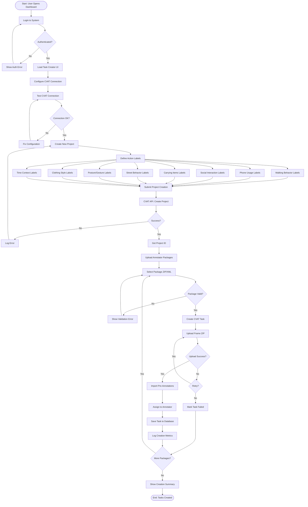

## 3. Annotation Workflow

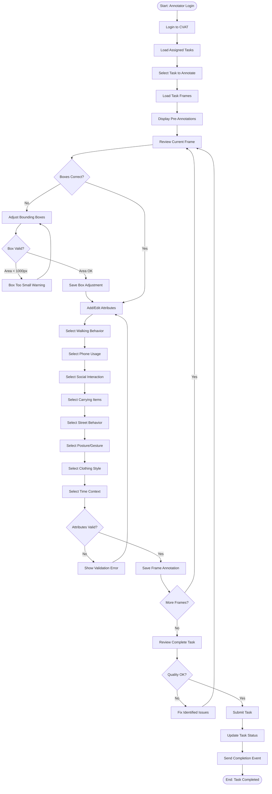

## 4. Quality Control Pipeline Flow

```mermaid
flowchart TD
    Start([Start: Task Completed Event]) --> ReceiveWebhook[Receive Webhook]
    ReceiveWebhook --> ParseEvent[Parse Event Data]

    ParseEvent --> ExtractTaskID[Extract Task ID]
    ExtractTaskID --> ExtractAnnotator[Extract Annotator]

    ExtractAnnotator --> Stage1[Stage 1: Export Annotations]

    Stage1 --> RequestExport[Request CVAT Export]
    RequestExport --> PollExport{Export Ready?}

    PollExport -->|No| Wait5Sec[Wait 5 Seconds]
    Wait5Sec --> PollExport

    PollExport -->|Yes| DownloadXML[Download XML]
    DownloadXML --> ParseXML[Parse CVAT XML]

    ParseXML --> Stage2[Stage 2: Rule Validation]

    Stage2 --> LoadRules[Load rules.yaml]
    LoadRules --> ForEachAnnotation[For Each Annotation]

    ForEachAnnotation --> CheckMaxLabels{Labels <= 4?}
    CheckMaxLabels -->|No| FlagOverlabel[Flag: OVERLABEL]
    FlagOverlabel --> NextAnnotation

    CheckMaxLabels -->|Yes| CheckMinArea{Area >= 1000px?}
    CheckMinArea -->|No| BlockTinyBox[Block: TINY_BOX]
    BlockTinyBox --> NextAnnotation

    CheckMinArea -->|Yes| CheckMutualExcl{Check Mutual Exclusivity}
    CheckMutualExcl -->|Violated| BlockMEConflict[Block: ME_CONFLICT]
    BlockMEConflict --> NextAnnotation

    CheckMutualExcl -->|OK| CheckContext{Check Context Rules}
    CheckContext -->|Missing| FlagContextMiss[Flag: CONTEXT_MISS]
    FlagContextMiss --> NextAnnotation

    CheckContext -->|OK| PassValidation[Pass Validation]
    PassValidation --> NextAnnotation[Next Annotation?]

    NextAnnotation -->|Yes| ForEachAnnotation
    NextAnnotation -->|No| Stage3[Stage 3: Store Annotations]

    Stage3 --> ConnectDB[Connect to PostgreSQL]
    ConnectDB --> StoreAnnotations[Store in annotations table]
    StoreAnnotations --> UpdateTaskStatus[Update task status]

    UpdateTaskStatus --> Stage4[Stage 4: Find Partner Task]

    Stage4 --> QueryOverlapGroup[Query Overlap Group]
    QueryOverlapGroup --> PartnerFound{Partner Task?}

    PartnerFound -->|No| MarkSingle[Mark as Single Task]
    MarkSingle --> EndQC

    PartnerFound -->|Yes| CheckPartnerComplete{Partner Complete?}
    CheckPartnerComplete -->|No| WaitPartner[Wait for Partner]
    WaitPartner --> EndQC

    CheckPartnerComplete -->|Yes| Stage5[Stage 5: Calculate Metrics]

    Stage5 --> LoadBothAnnotations[Load Both Annotations]
    LoadBothAnnotations --> MatchFrames[Match Frames]

    MatchFrames --> ForEachFrame[For Each Frame Pair]
    ForEachFrame --> MatchPersons[Match Person Boxes]
    MatchPersons --> CalculateIoU[Calculate IoU]

    CalculateIoU --> StoreFrameIoU[Store Frame IoU]
    StoreFrameIoU --> CompareAttributes[Compare Attributes]
    CompareAttributes --> CalculateKappa[Calculate Cohen's Kappa]

    CalculateKappa --> StoreKappa[Store Kappa Score]
    StoreKappa --> MoreFrames{More Frames?}

    MoreFrames -->|Yes| ForEachFrame
    MoreFrames -->|No| AggregateMetrics[Aggregate Metrics]

    AggregateMetrics --> CalcMeanIoU[Calculate Mean IoU]
    CalcMeanIoU --> CalcMeanKappa[Calculate Mean Kappa]
    CalcMeanKappa --> CalcFlipRate[Calculate Flip Rates]

    CalcFlipRate --> Stage6[Stage 6: Quality Decision]

    Stage6 --> CheckThresholds{IoU >= 0.5 AND Kappa >= 0.6?}

    CheckThresholds -->|Yes| ApproveTask[Approve Task]
    ApproveTask --> UpdateQCStatus[qc_status = 'approved']

    CheckThresholds -->|No| CheckAudit{Random Audit Sample?}
    CheckAudit -->|60% Yes| RouteAdjudication[Route to Adjudication]
    RouteAdjudication --> UpdateQCStatus2[qc_status = 'adjudicate']

    CheckAudit -->|40% No| RejectTask[Reject Task]
    RejectTask --> UpdateQCStatus3[qc_status = 'rejected']

    UpdateQCStatus --> SaveMetrics[Save Quality Metrics]
    UpdateQCStatus2 --> SaveMetrics
    UpdateQCStatus3 --> SaveMetrics

    SaveMetrics --> EndQC([End: QC Complete])
```

## 5. Dataset Generation Flow

```mermaid
flowchart TD
    Start([Start: Generate Dataset Request]) --> SelectProject[Select Project]
    SelectProject --> SetParameters[Set Generation Parameters]

    SetParameters --> Format[Select Format: AVA CSV]
    SetParameters --> ApprovedOnly[Approved Only: Yes/No]
    SetParameters --> ConsensusStrategy[Consensus: Majority Vote]

    Format --> ValidateParams{Parameters Valid?}
    ApprovedOnly --> ValidateParams
    ConsensusStrategy --> ValidateParams

    ValidateParams -->|No| ShowParamError[Show Parameter Error]
    ShowParamError --> SetParameters

    ValidateParams -->|Yes| Stage1[Stage 1: Query Annotations]

    Stage1 --> BuildQuery[Build SQL Query]
    BuildQuery --> FilterApproved{Approved Only?}

    FilterApproved -->|Yes| AddApprovedFilter[Add qc_status = 'approved']
    FilterApproved -->|No| IncludeAll[Include All Completed]

    AddApprovedFilter --> ExecuteQuery[Execute Query]
    IncludeAll --> ExecuteQuery

    ExecuteQuery --> CheckResults{Annotations Found?}
    CheckResults -->|No| NoDataError[Error: No Data]
    NoDataError --> End([End: Failed])

    CheckResults -->|Yes| Stage2[Stage 2: Load Manifest]

    Stage2 --> LoadKeyframeManifest[Load Keyframe Manifest]
    LoadKeyframeManifest --> MapFrameToVideo[Map Frames to Videos]

    MapFrameToVideo --> Stage3[Stage 3: Process Annotations]

    Stage3 --> GroupByVideo[Group by Video ID]
    GroupByVideo --> ForEachVideo[For Each Video]

    ForEachVideo --> SortByTimestamp[Sort by Timestamp]
    SortByTimestamp --> ForEachFrame[For Each Frame]

    ForEachFrame --> GetOverlapAnnotations[Get Overlap Annotations]
    GetOverlapAnnotations --> HasOverlap{Has Overlap?}

    HasOverlap -->|No| UseDirectAnnotation[Use Single Annotation]
    UseDirectAnnotation --> ProcessPerson

    HasOverlap -->|Yes| ApplyConsensus[Apply Consensus Logic]

    ApplyConsensus --> MajorityVote[Majority Vote on Attributes]
    MajorityVote --> AverageBoxes[Average Bounding Boxes]
    AverageBoxes --> WeightByConfidence[Weight by Confidence]

    WeightByConfidence --> ProcessPerson[Process Each Person]

    ProcessPerson --> ExtractBBox[Extract Bounding Box]
    ExtractBBox --> NormalizeCoords[Normalize to [0,1]]
    NormalizeCoords --> ExtractAttributes[Extract Attributes]

    ExtractAttributes --> MapToActionID[Map to Action ID]
    MapToActionID --> FormatRow[Format AVA CSV Row]

    FormatRow --> ValidateRow{Row Valid?}
    ValidateRow -->|No| LogInvalidRow[Log Invalid Row]
    LogInvalidRow --> NextPerson

    ValidateRow -->|Yes| AppendToBuffer[Append to Buffer]
    AppendToBuffer --> NextPerson{More Persons?}

    NextPerson -->|Yes| ProcessPerson
    NextPerson -->|No| NextFrame{More Frames?}

    NextFrame -->|Yes| ForEachFrame
    NextFrame -->|No| NextVideo{More Videos?}

    NextVideo -->|Yes| ForEachVideo
    NextVideo -->|No| Stage4[Stage 4: Finalize Dataset]

    Stage4 --> CreateCSVFile[Create CSV File]
    CreateCSVFile --> AddHeaders[Add AVA Headers]
    AddHeaders --> WriteBuffer[Write Buffer to File]

    WriteBuffer --> ValidateDataset{Dataset Valid?}
    ValidateDataset -->|No| DatasetError[Log Dataset Error]
    DatasetError --> End2([End: Failed])

    ValidateDataset -->|Yes| Stage5[Stage 5: Upload to S3]

    Stage5 --> CheckS3Config{S3 Configured?}
    CheckS3Config -->|No| SaveLocal[Save Locally]
    SaveLocal --> GenerateLocalPath[Generate Local Path]
    GenerateLocalPath --> ReturnPath

    CheckS3Config -->|Yes| GenerateS3Key[Generate S3 Key]
    GenerateS3Key --> UploadToS3[Upload to S3]
    UploadToS3 --> GeneratePresignedURL[Generate Presigned URL]

    GeneratePresignedURL --> ReturnPath[Return Download Path]
    ReturnPath --> LogMetrics[Log Generation Metrics]
    LogMetrics --> Success([End: Dataset Ready])
```

## 6. Rule Engine Validation Flow

```mermaid
flowchart TD
    Start([Start: Annotation Validation]) --> LoadAnnotation[Load Annotation Data]
    LoadAnnotation --> LoadRules[Load rules.yaml]

    LoadRules --> ParseRules[Parse Validation Rules]
    ParseRules --> InitResults[Initialize Validation Results]

    InitResults --> Rule1[Rule 1: Check Label Count]

    Rule1 --> CountActiveLabels[Count Non-'unknown' Labels]
    CountActiveLabels --> CheckMaxLabels{Count <= max_active_labels?}

    CheckMaxLabels -->|No| AddOverlabelFlag[Add OVERLABEL Flag]
    AddOverlabelFlag --> Rule2

    CheckMaxLabels -->|Yes| Rule2[Rule 2: Check Box Area]

    Rule2 --> CalculateArea[Calculate BBox Area]
    CalculateArea --> CheckMinArea{Area >= min_box_area?}

    CheckMinArea -->|No| AddTinyBoxBlock[Add TINY_BOX Block]
    AddTinyBoxBlock --> Rule3

    CheckMinArea -->|Yes| CheckMaxArea{Area <= max_box_area?}
    CheckMaxArea -->|No| AddHugeBoxFlag[Add HUGE_BOX Flag]
    AddHugeBoxFlag --> Rule3

    CheckMaxArea -->|Yes| Rule3[Rule 3: Mutual Exclusivity]

    Rule3 --> GetMEGroups[Get Mutual Exclusivity Groups]
    GetMEGroups --> ForEachMEGroup[For Each ME Group]

    ForEachMEGroup --> CountGroupActive[Count Active in Group]
    CountGroupActive --> CheckMEViolation{Multiple Active?}

    CheckMEViolation -->|Yes| AddMEBlock[Add ME_CONFLICT Block]
    AddMEBlock --> NextMEGroup

    CheckMEViolation -->|No| NextMEGroup{More ME Groups?}
    NextMEGroup -->|Yes| ForEachMEGroup
    NextMEGroup -->|No| Rule4[Rule 4: Context Preconditions]

    Rule4 --> GetContextRules[Get Context Rules]
    GetContextRules --> ForEachAttribute[For Each Attribute]

    ForEachAttribute --> NeedsContext{Requires Context?}
    NeedsContext -->|No| NextAttribute

    NeedsContext -->|Yes| CheckContext[Check Required Context]
    CheckContext --> ContextPresent{Context Found?}

    ContextPresent -->|No| AddContextFlag[Add CONTEXT_MISS Flag]
    AddContextFlag --> NextAttribute

    ContextPresent -->|Yes| NextAttribute{More Attributes?}
    NextAttribute -->|Yes| ForEachAttribute
    NextAttribute -->|No| Rule5[Rule 5: Custom Validations]

    Rule5 --> CheckCustomRules[Apply Custom Rules]
    CheckCustomRules --> AggregateResults[Aggregate All Results]

    AggregateResults --> DetermineAction[Determine Final Action]
    DetermineAction --> HasBlocks{Any Blocks?}

    HasBlocks -->|Yes| BlockAnnotation[Block Annotation]
    BlockAnnotation --> ReturnBlocked

    HasBlocks -->|No| HasFlags{Any Flags?}
    HasFlags -->|Yes| FlagAnnotation[Flag for Review]
    FlagAnnotation --> ReturnFlagged

    HasFlags -->|No| PassAnnotation[Pass Validation]
    PassAnnotation --> ReturnPassed

    ReturnBlocked --> End([End: Validation Complete])
    ReturnFlagged --> End
    ReturnPassed --> End
```

---

## SEQUENCE DIAGRAMS

## 7. Complete End-to-End Workflow

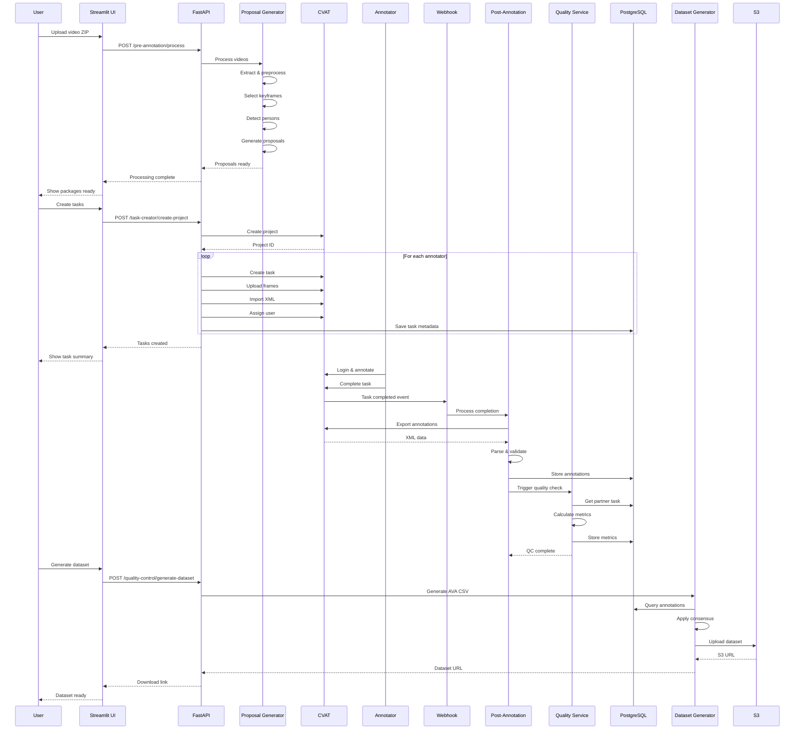

## 8. Pre-Annotation Processing

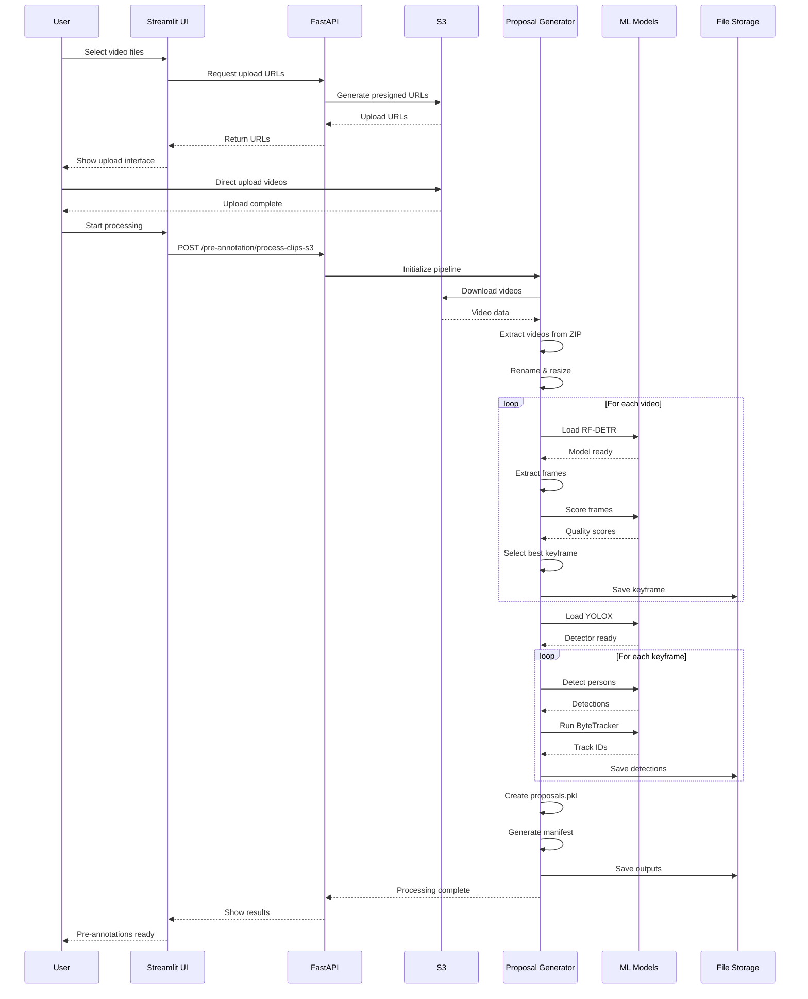

## 9. Multi-Annotator Assignment

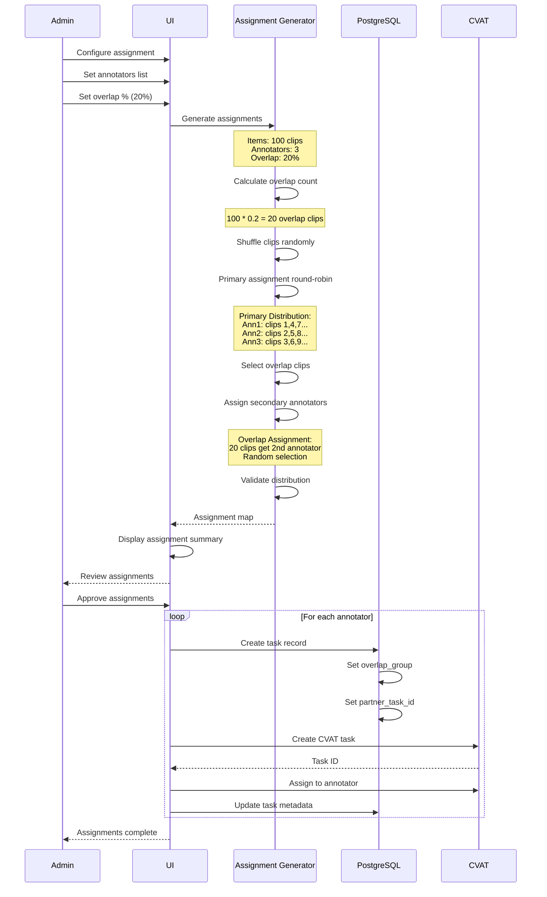

## 10. Post-Annotation Retrieval

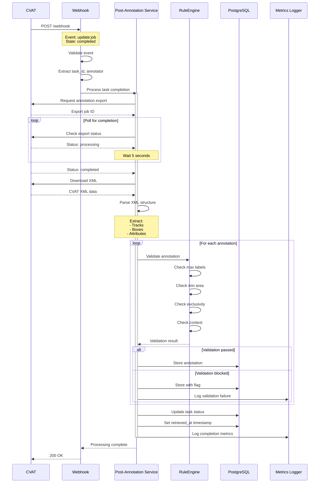

## 11. Quality Metrics Calculation

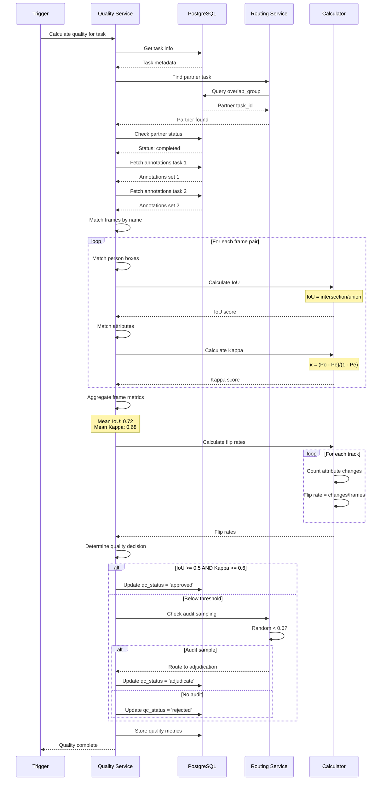

## 12. Consensus Generation

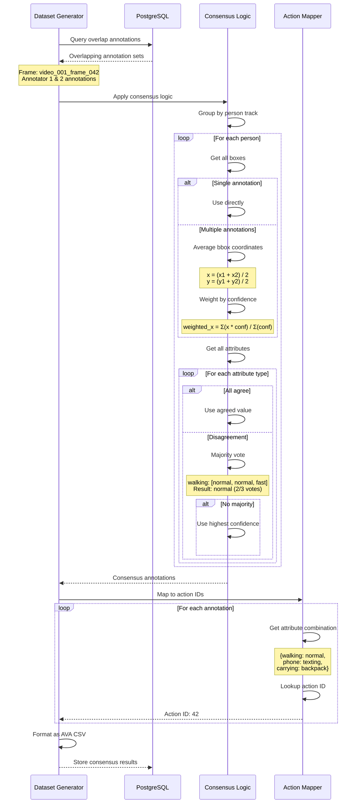

## 13. S3 Integration Workflow

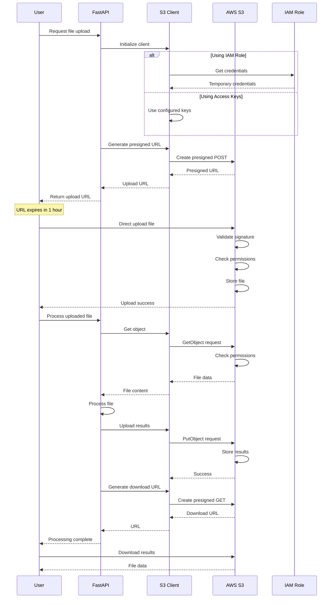

## 14. Error Recovery Flow

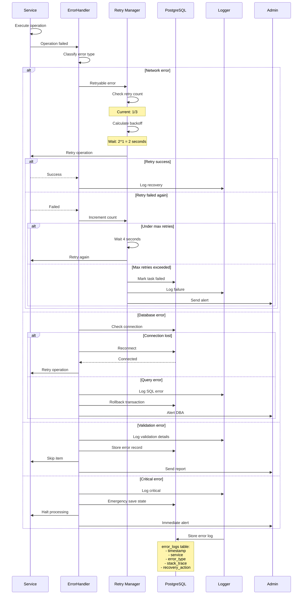

---

## Flow Chart and Sequence Diagram Summary

This document provides comprehensive flow charts and sequence diagrams for the AVA_Kinetics_QC system:

### Flow Charts (6 diagrams)
1. **Proposal Generation Pipeline** - Complete video processing workflow
2. **Task Creation** - CVAT task setup and configuration
3. **Annotation Workflow** - Annotator interaction flow
4. **Quality Control Pipeline** - Multi-stage quality validation
5. **Dataset Generation** - Consensus and export workflow
6. **Rule Engine Validation** - Detailed validation logic

### Sequence Diagrams (8 diagrams)
1. **End-to-End Workflow** - Complete system interaction
2. **Pre-Annotation Processing** - Video to proposal conversion
3. **Multi-Annotator Assignment** - Task distribution logic
4. **Post-Annotation Retrieval** - Webhook-triggered export
5. **Quality Metrics Calculation** - IAA computation
6. **Consensus Generation** - Multi-annotator agreement
7. **S3 Integration** - Cloud storage workflow
8. **Error Recovery** - Fault tolerance mechanisms

These diagrams visualize:
- **Data transformations** at each stage
- **Decision points** and branching logic
- **Error handling** and recovery paths
- **Service interactions** and dependencies
- **Validation rules** and quality checks

The diagrams use Mermaid syntax for easy rendering in:
- GitHub/GitLab markdown
- VS Code with extensions
- Documentation tools
- Web-based Mermaid editors

---

*Diagrams Version: 1.0.0*
*Last Updated: November 2024*